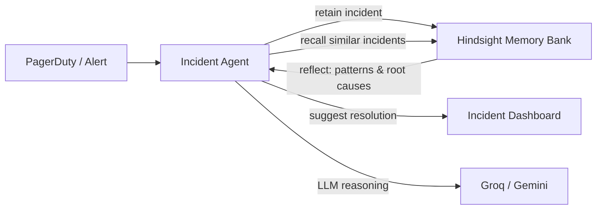

# HackwithHyderabad 3.0 — Project Ideas

## Judging Criteria Reminder
| Criteria | Weight | What Judges Want |
|:---|:---:|:---|
| Innovation | 30% | Novel problem framing; not a wrapper around an LLM |
| Use of Hindsight Memory | 25% | Deep retain/recall/reflect cycles; show "with vs without memory" |
| Technical Implementation | 20% | Clean code, proper architecture, working demo |
| UX / Demo | 15% | Intuitive, polished, 60-second "wow" moment |
| Real-world Impact | 10% | Solves a genuine pain point for real people |

> [!IMPORTANT]
> The top two criteria (Innovation + Hindsight Memory) account for **55%** of the score. Every idea below is designed to maximize both.

---

## Idea 1 — **PostMortem Pilot** (DevOps Incident Memory Agent)

### The Problem
When a production incident happens at 3 AM, the on-call engineer scrambles through Slack threads, Confluence pages, and past Jira tickets to figure out *"have we seen this before?"*. Past incident learnings are scattered and forgotten.

### How Hindsight Fits (Deep)
| Memory Operation | What It Does |
|:---|:---|
| **Retain** | After each incident, agent ingests the root-cause analysis, affected services, resolution steps, and timeline |
| **Recall** | When a new alert fires, agent recalls similar past incidents using semantic + temporal filtering ("last 90 days, database-related") |
| **Reflect** | Agent synthesizes patterns: *"3 of the last 5 outages involved connection pool exhaustion after deployments — consider adding a post-deploy health check"* |

### Demo Script (Side-by-Side)
1. **Without Memory**: Agent sees new alert → gives generic troubleshooting steps
2. **With Hindsight**: Agent sees same alert → recalls that an identical symptom 2 months ago was caused by a bad config push → suggests checking the specific config file → resolves in seconds

### Architecture

### Why It Could Win
- **Innovation (30%)**: Not a chatbot — it's a *learning incident responder* that gets smarter with each outage
- **Hindsight (25%)**: Uses all three operations (retain/recall/reflect) deeply
- **Impact (10%)**: Every tech company has this problem; saves MTTR (Mean Time To Resolve)

### Difficulty: 🟡 Medium
### Estimated Build Time: 6-7 hours

---

## Idea 2 — **DealMind** (Sales Conversation Memory Agent)

### The Problem
Sales reps handle 30+ deals simultaneously. Before every call, they spend 20 minutes re-reading CRM notes, email threads, and past call transcripts to remember: *"What were their objections? What pricing did we discuss? Who's the decision maker?"*

### How Hindsight Fits (Deep)
| Memory Operation | What It Does |
|:---|:---|
| **Retain** | After each call/email, agent extracts: objections raised, budget signals, competitor mentions, stakeholder preferences, next steps |
| **Recall** | Before a new call, agent recalls the full deal history for that prospect + recalls similar deals that closed successfully |
| **Reflect** | Agent synthesizes a pre-call brief: *"This prospect mentioned budget freeze in Q2 but showed interest in the enterprise tier. Similar deals closed after offering a pilot program."* |

### Demo Script
1. Feed 5 simulated call transcripts for a deal over 3 months
2. Ask the agent to prepare a pre-call brief for the next meeting
3. **Without Memory**: Generic sales advice
4. **With Hindsight**: Personalized brief with objection history, pricing context, and recommended closing strategy pulled from memory

### Why It Could Win
- **Innovation (30%)**: Goes beyond CRM — it's a deal *strategist* that learns from your past wins
- **Hindsight (25%)**: Multi-entity memory (prospects, deals, objections) with temporal reasoning
- **UX (15%)**: A clean "pre-call brief" card is visually compelling in a demo

### Difficulty: 🟢 Easy-Medium
### Estimated Build Time: 5-6 hours

---

## Idea 3 — **CodeCompass** (Codebase Architecture Memory Agent)

### The Problem
When developers join a new team or return to a project after weeks, they ask the same questions: *"Why did we use this library? What's the convention for error handling here? Why was this approach chosen over the alternative?"*. These decisions live in old PR comments and forgotten Slack threads.

### How Hindsight Fits (Deep)
| Memory Operation | What It Does |
|:---|:---|
| **Retain** | Agent ingests PR descriptions, code review comments, ADRs (Architecture Decision Records), and commit messages to build a "project brain" |
| **Recall** | When a developer asks "why do we use Redis here instead of Memcached?", agent recalls the specific PR discussion and performance benchmarks that led to that choice |
| **Reflect** | Agent builds evolving "mental models" of the project: *"The team prefers composition over inheritance, avoids ORMs for performance-critical paths, and uses feature flags for all new features"* |

### Demo Script
1. Feed 10 simulated PR descriptions and code review comments
2. Ask: "I'm adding a new caching layer, what should I know?"
3. **Without Memory**: Generic caching best practices
4. **With Hindsight**: "Based on PR #47 and #83, the team chose Redis over Memcached for its pub/sub capability. The convention is to use a `cache_` prefix for all cache keys (per review comment by Sarah on PR #52). Avoid setting TTLs below 60s — that caused a thundering herd in the last sprint."

### Why It Could Win
- **Innovation (30%)**: Solves "tribal knowledge" loss — every engineering team's nightmare
- **Hindsight (25%)**: Reflect is the star here — building evolving project mental models
- **Impact (10%)**: Directly reduces onboarding time from weeks to days

### Difficulty: 🟡 Medium
### Estimated Build Time: 6-7 hours

---

## Idea 4 — **ClinicMemory** (Patient Context Agent for Doctors)

### The Problem
Doctors see 30-40 patients/day. When a returning patient walks in, the doctor skims through a dense medical history PDF to recall: *"What medications are they on? Did that last treatment work? Are there any drug interactions I should watch for?"*

### How Hindsight Fits (Deep)
| Memory Operation | What It Does |
|:---|:---|
| **Retain** | After each visit, agent retains: symptoms, diagnoses, prescriptions, patient preferences ("allergic to penicillin"), and treatment outcomes |
| **Recall** | Before the next visit, agent recalls the full patient timeline + recalls similar patient cases from the memory bank |
| **Reflect** | Agent reflects on treatment effectiveness: *"Patient was prescribed Metformin 6 months ago. Last two visits showed HbA1c improved from 8.2 to 7.1 — treatment is working. However, patient reported GI side effects both times — consider switching to extended-release formulation."* |

### Demo Script
1. Simulate 4 patient visits over 8 months
2. Patient arrives for visit #5
3. **Without Memory**: "Please describe your symptoms" (starts from zero)
4. **With Hindsight**: "Welcome back. Last visit you reported the stomach issues with Metformin were improving. Your HbA1c trend is positive. Let's check if we should adjust the dosage or switch to extended-release."

### Why It Could Win
- **Innovation (30%)**: Healthcare + AI memory = high-impact, underexplored territory
- **Hindsight (25%)**: Per-patient memory banks, temporal reasoning over treatment history, cross-patient pattern detection via reflect
- **Impact (10%)**: Directly improves patient care quality — strong emotional resonance with judges

### Difficulty: 🟡 Medium
### Estimated Build Time: 6-7 hours

> [!WARNING]
> Healthcare ideas can be powerful for demos but require careful disclaimers ("not for real clinical use"). This can actually *help* the presentation — it shows maturity.

---

## Idea 5 — **DebugDeja** (Bug Pattern Memory Agent)

### The Problem
Development teams encounter the same types of bugs repeatedly across projects. A `NullPointerException` in a payment module might have been solved 3 months ago, but the developer facing it today has no way to know that — they spend hours debugging from scratch.

### How Hindsight Fits (Deep)
| Memory Operation | What It Does |
|:---|:---|
| **Retain** | Every resolved bug gets retained: error signature, stack trace pattern, root cause, fix applied, and files involved |
| **Recall** | When a new bug report comes in, agent recalls similar bugs by error pattern + affected module |
| **Reflect** | Agent identifies recurring patterns: *"This is the 4th time a null pointer has occurred in the payment module after a database migration. The root cause each time was missing default values in the new schema. Recommendation: add a post-migration validation step."* |

### Demo Script
1. Feed 8 resolved bug reports over simulated weeks
2. New bug arrives with a similar stack trace
3. **Without Memory**: Generic debugging suggestions
4. **With Hindsight**: "This matches bug #BUG-142 from 6 weeks ago (92% similarity). Root cause was a missing null check in `PaymentService.processRefund()` after the March schema migration. Fix applied was adding `COALESCE` defaults. I also notice this is a recurring pattern — 3 similar bugs in the last quarter, all post-migration."

### Why It Could Win
- **Innovation (30%)**: Turns bug history into institutional intelligence
- **Hindsight (25%)**: Pattern detection via reflect across temporal windows is very impressive to judges
- **UX (15%)**: Side-by-side "cold debug vs memory-assisted debug" is a killer demo

### Difficulty: 🟢 Easy-Medium
### Estimated Build Time: 5-6 hours

---

## Idea 6 — **HireTrack** (Hiring Pipeline Memory Agent)

### The Problem
Hiring managers and recruiters conduct hundreds of interviews per quarter. They forget why they passed on a candidate, what made a past hire successful, and which interview questions actually predict performance. Every hiring cycle starts from scratch.

### How Hindsight Fits (Deep)
| Memory Operation | What It Does |
|:---|:---|
| **Retain** | After each interview round, agent retains: candidate strengths/weaknesses, interviewer notes, cultural fit signals, and hiring decision rationale |
| **Recall** | For new candidates, agent recalls similar past candidates and their outcomes (hired → performed well/poorly) |
| **Reflect** | Agent reflects on hiring patterns: *"Candidates who scored high on 'system design' but low on 'collaboration' had a 70% attrition rate within 1 year. Consider weighting collaboration more heavily."* |

### Demo Script
1. Feed 15 simulated interview summaries with outcomes (hired/rejected, 6-month performance)
2. New candidate profile arrives
3. **Without Memory**: Generic interview feedback template
4. **With Hindsight**: "This candidate profile is similar to 3 past hires. 2 of the 3 performed in the top quartile. Key differentiator was their system design approach. Suggested follow-up questions based on where similar candidates had gaps."

### Why It Could Win
- **Innovation (30%)**: Hiring is a billion-dollar problem, rarely approached with agent memory
- **Hindsight (25%)**: Cross-entity linking (candidate ↔ interviewer ↔ outcome) showcases graph memory
- **Impact (10%)**: Every company hires; reducing bad hires saves \$50K-\$200K per mistake

### Difficulty: 🟡 Medium
### Estimated Build Time: 6-7 hours

---

## Comparison Matrix

| Idea | Innovation | Hindsight Depth | Build Difficulty | Demo Impact | Real-world Impact | **Overall Score** |
|:---|:---:|:---:|:---:|:---:|:---:|:---:|
| **PostMortem Pilot** (DevOps) | ⭐⭐⭐⭐ | ⭐⭐⭐⭐⭐ | 🟡 Medium | ⭐⭐⭐⭐ | ⭐⭐⭐⭐ | **🏆 High** |
| **DealMind** (Sales) | ⭐⭐⭐⭐ | ⭐⭐⭐⭐ | 🟢 Easy | ⭐⭐⭐⭐⭐ | ⭐⭐⭐⭐ | **🏆 High** |
| **CodeCompass** (Codebase) | ⭐⭐⭐⭐⭐ | ⭐⭐⭐⭐⭐ | 🟡 Medium | ⭐⭐⭐⭐ | ⭐⭐⭐⭐⭐ | **🏆🏆 Very High** |
| **ClinicMemory** (Healthcare) | ⭐⭐⭐⭐⭐ | ⭐⭐⭐⭐⭐ | 🟡 Medium | ⭐⭐⭐⭐⭐ | ⭐⭐⭐⭐⭐ | **🏆🏆 Very High** |
| **DebugDeja** (Bug Patterns) | ⭐⭐⭐⭐ | ⭐⭐⭐⭐ | 🟢 Easy | ⭐⭐⭐⭐⭐ | ⭐⭐⭐ | **🏆 High** |
| **HireTrack** (Hiring) | ⭐⭐⭐⭐⭐ | ⭐⭐⭐⭐ | 🟡 Medium | ⭐⭐⭐⭐ | ⭐⭐⭐⭐⭐ | **🏆🏆 Very High** |

---

## My Top Recommendations

### 🥇 Best Overall: **CodeCompass** or **ClinicMemory**
Both score highest because they deeply exploit all three Hindsight operations (especially **Reflect**) and solve genuinely painful, relatable problems. CodeCompass is safer (dev audience = dev judges), ClinicMemory has more emotional impact.

### 🥈 Safest to Build in Time: **DealMind** or **DebugDeja**
These are the easiest to build within the hackathon timeframe while still scoring well. DealMind has a cleaner demo story. DebugDeja is more relatable to developer judges.

### 🥉 Most Unique (High Risk, High Reward): **HireTrack**
Nobody will build a hiring memory agent. The cross-entity graph memory (candidate → interviewer → outcome) is technically impressive. Risk: may feel niche to some judges.

---

## Open Questions

> [!IMPORTANT]
> **Which idea excites you most?** Once you pick one, I'll create a detailed implementation plan with:
> - Full file/folder structure
> - Exact Hindsight API integration code
> - Synthetic demo data
> - Step-by-step build timeline for the hackathon day
> - Content/article strategy tailored to the chosen project

> [!NOTE]
> **What tech stack do you prefer?** (Python + FastAPI, Node.js + Next.js, or something else?) This will affect the architecture plan.
